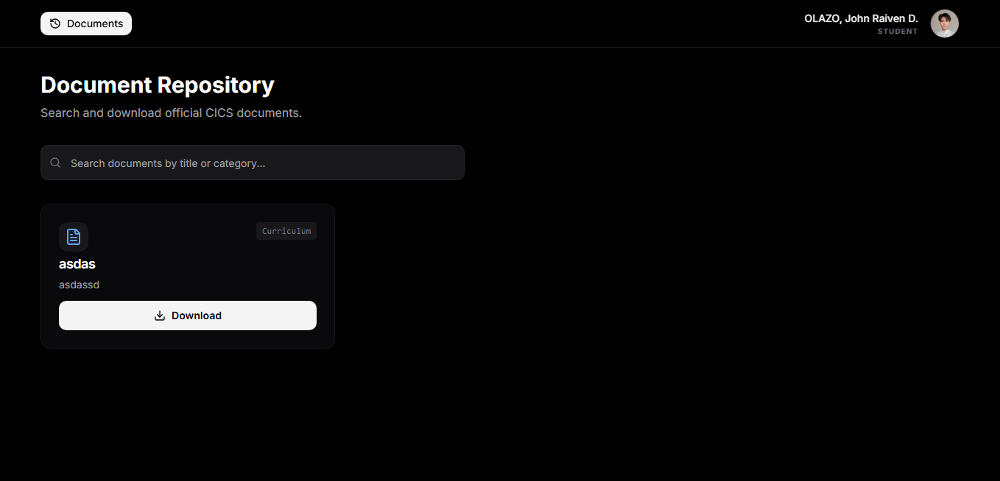
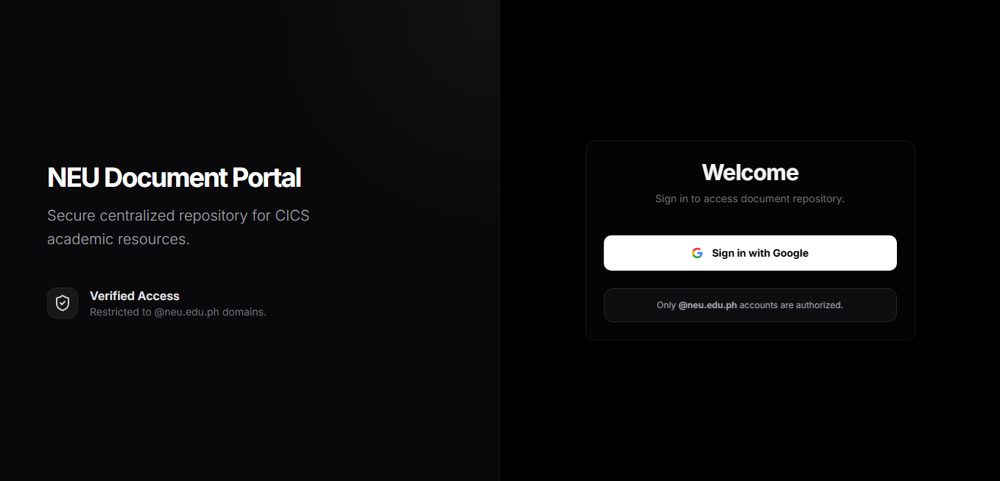
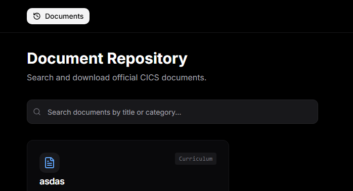
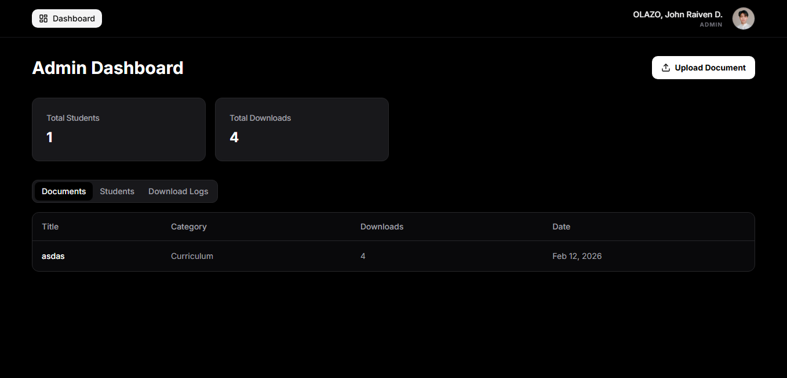

# CICS Document Portal

A central repository for CICS students and faculty to manage, share, and download official college documents.



## Overview

This portal serves as a digital distribution channel for college forms, memos, and curriculum guides. It ensures that students have access to the correct, up-to-date files without needing to visit the office physically.

## Features

### For Students
*   **Single Sign-On (SSO)**: Login using official `@neu.edu.ph` email.
*   **Document Search**: Filter and find documents by category (Memo, Form, Curriculum).
*   **Profile Setup**: Set program (BSCS, BSIT) on first login to see relevant content.

### For Admins
*   **File Management**: Upload PDF documents and assign categories.
*   **Download Tracking**: View stats on which documents are downloaded most.
*   **Audit Logs**: Track who accessed which document and when.

## Screenshots

| Login Page | Student Dashboard |
|:---:|:---:|
|  |  |

| Document Search | Admin Panel |
|:---:|:---:|
|  |  |

## Tech Stack

*   **Frontend**: Next.js 14, TypeScript, Tailwind CSS
*   **Backend**: Firebase (Firestore, Storage, Auth)
*   **Styling**: shadcn/ui components

## Setup & Installation

1.  **Clone the repo**
    ```bash
    git clone https://github.com/johnraivenolazo/neu-document-portal.git
    cd neu-document-portal
    ```

2.  **Install dependencies**
    ```bash
    pnpm install
    ```

3.  **Configure Environment**
    Set up your `.env.local` with Firebase credentials (API Key, Project ID, etc.).

4.  **Run locally**
    ```bash
    pnpm dev
    ```

## Admin Access

To promote a user to **Admin**:
1.  Go to your Firestore database.
2.  Find or create the `roles_admin` collection.
3.  Add a document with the user's **UID**.
4.  Set the field `active` to `true`.
